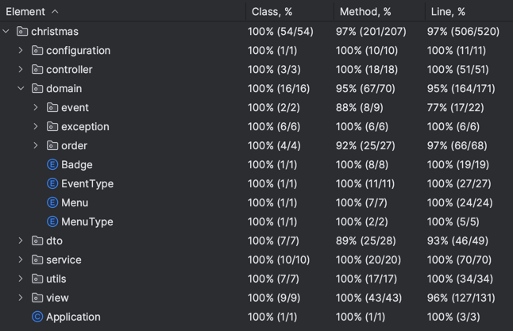
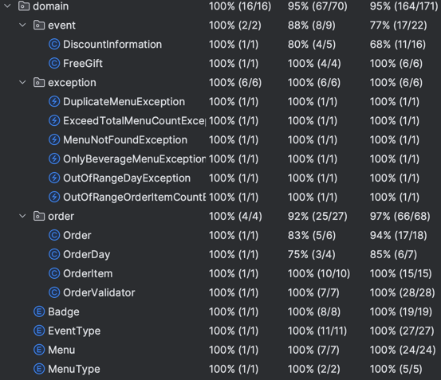

## ✅ 기능 목록 정리

#### *[x]: 구현한 기능, ☑️: 테스트한 기능*

### 크리스마스 프로모션 핵심 로직 기능

#### 1. 주문 관련 비즈니스 기능

- 주문이 가능한지 확인하는 기능
    - [x] ☑️ 주문한 메뉴가 우테코 메뉴에 존재하는지 검증하는 기능
        - [x] ☑️ 우테코 메뉴에 존재하는지 찾는 기능
    - [x] ☑️ 중복 메뉴가 존재하는지 검증하는 기능
        - [x] ☑️ 중복 메뉴를 검출하여 생성하는 기능
    - [x] ☑️ 음료 메뉴만 주문했는지 검증하는 기능
        - [x] ☑️ 음료 메뉴만 존재하는지 확인하는 기능
    - [x] ☑️ 총 주문 개수가 20개 초과인지 검증하는 기능
        - [x] ☑️ 총 주문 개수를 계산하는 기능
    - [x] ☑️ 단 건 주문 수량이 1 ~ 20개인지 검증하는 기능
    - ☑️ 주문 날짜가 1 ~ 31일인지 검증하는 기능
- [x] ☑️ 주문을 생성하는 기능
- [x] ☑️ 주문 아이템 리스트를 생성하는 기능
- [x] ☑️ 주문 아이템의 금액을 계산하는 기능
- [x] ☑️ 총 주문 금액을 계산하는 기능
- [x] ☑️ 특정 메뉴의 총 주문 개수를 계산하는 기능
    - [x] ☑️ 특정 메뉴와 일치하는지 확인하는 기능
- [x] ☑️ 총 혜택 금액을 계산하는 기능
    - 총 혜택 금액 = 할인금액 합계 + 증정 메뉴의 가격
- [x] ☑️ 할인 후 예상 결제 금액을 계산하는 기능
    - 할인 전 총주문 금액 - 할인 금액

#### 2. 이벤트 관련 비즈니스 기능

*❗크리스마스 디데이 할인을 제외한 다른 이벤트는 2023.12.1 ~ 2023.12.31 동안 적용*

**1️⃣-1️⃣ 할인 관련 로직 기능**

- [x] ☑️ 이벤트 적용이 가능한지 확인하는 기능
    - 총 주문 금액 10,000원 이상부터 가능하다.
- [x] ☑️ 크리스마스 할인 이벤트 날짜를 계산하는 기능
- [x] ☑️ 평일 할인 이벤트 날짜를 계산하는 기능
- [x] ☑️ 주말 할인 이벤트 날짜를 계산하는 기능
- [x] ☑️ 특별 할인 이벤트 날짜를 계산하는 기능
- [x] ☑️ 주문 날짜에 대하여 적용 가능한 이벤트 유형들을 계산하는 기능
- [x] ☑️ 주문에 대한 전체 할인 금액 계산 기능
- [x] ☑️ 주문에 대한 특정 이벤트 유형의 할인 금액 계산 기능
- [x] 할인 금액 계산 기능
- [x] ☑️ 크리스마스 디데이 할인 금액 계산 기능
    - 12월 예상 방문 날짜가 이벤트 기간(2023.12.1 ~ 2023.12.25)에 맞는지 확인한다.
    - 방문 날짜에 맞는 할인 금액을 계산한다.
- [x] ☑️ 평일 할인 금액 계산 기능
    - `디저트` 메뉴 1개당 2,023원 할인한다.
    - ❗️평일은 일요일 ~ 목요일임에 주의
- [x] ☑️ 주말 할인 금액 계산 기능
    - `메인` 메뉴 1개당 2,023원 할인한다.
    - ❗️주말은 금요일, 토요일임에 주의
- [x] ☑️ 특별 할인 금액 계산 기능
    - `이벤트 달력에 별`이 있으면 `총 주문 금액`에서 1,000원 할인한다.
    - ❗별: 3일, 10일, 17일, 24일, 25일, 31일

**1️⃣-2️⃣ 할인 관련 흐름 기능**

- [x] ☑️ 할인 이벤트를 적용하는 기능
- [x] ☑️ 할인 이벤트 유형별 할인 금액을 갱신하는 기능
- [x] ☑️ 할인을 실행하는 기능
    - [x] ☑️ 크리스마스 할인을 실행하는 기능
    - [x] ☑️ 평일 할인을 실행하는 기능
    - [x] ☑️ 주말 할인을 실행하는 기능
    - [x] ☑️ 특별 할인을 실행하는 기능

**2️⃣ 이벤트 상품 관련 기능**

- [x] ☑️증정 상품 이벤트를 적용하는 기능
    - `할인 전` 총 주문 금액이 12만원 이상일 때, 샴페인 1개 증정한다.
    - [x] ☑️ 증정 상품 이벤트를 계산하는 기능
    - [x] ☑️ 증정 상품의 혜택 금액을 계산하는 기능
- [x] ☑️ 이벤트 배지를 부여하는 기능
    - [x] ☑️ 총 혜택 금액에따라 이벤트 배지를 계산하는 기능
    - ❗️총 혜택 금액은 `할인금액 합계 + 증정 메뉴의 가격`이다. (`총 주문` 금액이 아님에 주의)

### 크리스마스 프로모션 입력 화면 기능

- [x] 날짜 입력 안내 메시지 화면을 출력한다.
    - 12월 중 식당 예상 방문 날짜는 언제인가요? (숫자만 입력해 주세요!)
- [x] 날짜를 입력받는 기능
    - [x] ☑️ 공백 입력을 검증하는 기능
    - [x] ☑️ 숫자를 검증하는 기능
    - [x] ☑️ 정수형을 검증하는 기능
    - ❗1 ~ 31 범위는 OrderDay에서 검증한다.

- [x] 메뉴폼 입력 안내 메시지 화면을 출력한다.
    - 주문하실 메뉴를 메뉴와 개수를 알려 주세요. (e.g. 해산물파스타-2,레드와인-1,초코케이크-1)
- [x] 메뉴폼을 입력받는 기능
    - [x] ☑️ 메뉴 형식 예시와 다른 입력을 검증하는 기능
        - 메뉴폼 [XXX-X,XXX-XX,...]을 검증한다.
        - 메뉴이름-숫자 [XXX-X]를 검증한다.
        - 메뉴이름의 공백을 검증한다.
        - 메뉴 숫자의 공백을 검증한다.
        - 메뉴 숫자의 숫자 여부를 검증한다.
    - ❗메뉴의 개수가 1이상의 수인지는 OrderItem에서 검증한다.
    - ❗메뉴판에 없는 메뉴인지는 OrderItem에서 검증한다.
    - ❗중복 메뉴인지는 Order에서 검증한다.
    - ❗음료 메뉴만 존재하는지는 Order에서 검증한다.
    - ❗총 메뉴 개수가 20개 초과인지는 Order에서 검증한다.

### 크리스마스 프로모션 출력 화면 기능

- [x] 시작 메시지를 출력하는 기능
    - 안녕하세요! 우테코 식당 12월 이벤트 플래너입니다.
- [x] 혜택 미리보기 안내 메시지를 출력하는 기능
    - 12월 3일에 우테코 식당에서 받을 이벤트 혜택 미리 보기!
- [x] 주문 메뉴를 출력하는 기능
    - <주문 메뉴>
    - `결과값`
- [x] 할인 전 총 주문 금액을 출력하는 기능
    - <할인 전 총주문 금액>
    - `결과값`
- [x] 증정 메뉴를 출력하는 기능
    - <증정 메뉴>
    - `결과값`
- [x] 혜택 내역을 출력하는 기능
    - <혜택 내역>
    - `결과값`
- [x] 총 혜 금액을 출력하는 기능
    - <총혜택 금액>
    - `결과값`
- [x] 할인 후 예상 결제 금액을 출력하는 기능
    - <할인 후 예상 결제 금액>
    - `결과값`
- [x] 배지 결과를 출력하는 기능
    - <12월 이벤트 배지>
    - `결과값`

**유틸**

- [x] 메뉴 입력 폼을 OrderRequest DTO로 변환해주는 기능

## ✅ 예외 상황 정리

- 식당 방문 날짜
    - 숫자가 아닌 입력
    - 1 ~ 31 범위가 아닌 입력
- 메뉴
    - 메뉴 형식예시와 다른 입력
    - 메뉴의 개수를 숫자가 아닌 다른 문자로 입력
    - 메뉴의 개수가 1이상의 수가 아닌 입력
    - 메뉴판에 없는 메뉴인 입력
    - 중복 메뉴 입력
    - 음료 메뉴만 입력
    - 총 메뉴 개수 20개 초과 입력

## ✅ 요구 사항 체크 리스트

### 1️⃣ 기능 요구 사항

- [x] 문제의 내용을 통해 유추하고 스스로 판단해 구현한다.

### 2️⃣ 프로그래밍 요구 사항

- [x] JDK 17 버전을 사용한다.
- [x] 프로그램 시작점은 Application의 main() 이다.
- [x] build.gradle 파일을 변경하지 않고, 외부 라이브러리 사용하지 않는다.
- [x] Java 코드 컨벤션 가이드를 준수한다.
    - [x] 스태틱 또는 와일드카드 import는 사용하지 않는다.
    - [x] 정확히 하나의 최상위 클래스를 선언한다.
    - [x] 클래스 내용은 논리적 순서로 구성한다.
    - [x] ...
- [x] 프로그램 종료시 System.exit() 호출하지 않는다.
- [x] ApplicationTest 의 모든 테스트를 성공한다.
- [x] 파일, 패키지의 이름을 수정하거나 이동하지 않는다.
- [x] 들여쓰기 depth는 2까지만 허용한다
- [x] 3항 연산자를 쓰지 않는다
- [x] 함수(또는 메서드)의 길이가 15라인을 넘어가지 않도록 구현한다.
    - [x] 함수(또는 메서드)가 한 가지 일만 하도록 최대한 작게 만들어라.
- [x] JUnit5와 AssertJ를 이용하여 본인이 정리한 기능 목록이 정상 동작함을 테스트 코드로 확인한다.
    - 
- [x] else 예약어를 쓰지 않는다.
    - [x] switch/case도 허용하지 않는다.
- [x] 도메인 로직에 단위 테스트를 구현해야 한다.
    - 
    - [x] System.out, System.in, Scanner 로직은 제외한다.
    - [x] 핵심 로직을 구현하는 코드와 UI를 담당하는 로직을 분리해 구현한다.인
- [x] 사용자가 잘못된 값을 입력할 경우 IllegalArgumentException를 발생시킨다.
    - [x] "[ERROR]"로 시작하는 에러 메시지를 출력 후 그 부분부터 입력을 다시 받는다.
    - [x] `Exception`이 아닌 `IllegalArgumentException`, `IllegalStateException` 등과 같은 명확한 유형을 처리한다.

**❗️추가된 요구 사항**

- [x] 입력과 출력을 담당하는 클래스를 별도로 구현한다.
- [x] 해당 클래스의 패키지, 클래스명, 메서드의 반환 타입과 시그니처는 자유롭게 구현할 수 있다.

**❗라이브러리**

- [x] 사용자 입력: `camp.nextstep.edu.missionutils.Console`의 `readLine()`

### 3️⃣ 과제 진행 요구 사항

- [x] 미션은 java-christmas-6 저장소를 **비공개 저장소**로 생성해 시작한다.
- [x] **기능을 구현하기 전 docs/README.md에 구현할 기능 목록을 정리**해 추가한다.
- [x] **Git의 커밋 단위는 앞 단계에서 docs/README.md에 정리한 기능 목록 단위**로 추가한다.
- [x] 커밋 메시지 컨벤션 가이드를 참고해 커밋 메시지를 작성한다.
- [x] 과제 진행 및 제출 방법은 프리코스 과제 제출 문서를 참고한다.

---

## ✅ 1 주차 공통 피드백 체크 리스트

- [x] 요구사항을 점검하고 정확히 준수한다
- [x] Java에서 제공하는 API를 적극 활용한다
- [x] 배열 대신 Java Collection을 사용한다
- [x] 커밋 메시지를 의미 있게 작성한다
- [x] 이름을 통해 의도를 드러낸다
- [x] 축약하지 않는다
- [x] 공백도 코딩 컨벤션이다
- [x] 의미 없는 주석을 달지 않는다
- [x] Java에서 제공하는 API를 적극 활용한다
- [x] 배열 대신 Java Collection을 사용한다
- [x] ...

## ✅ 2 주차 공통 피드백 체크 리스트

- [ ] README.md를 상세히 작성한다.
- [x] 기능 목록을 재검토한다.
- [x] 기능 목록을 업데이트하여 살아있는 문서를 만들기 위해 노력한다.
- [x] 값을 하드 코딩하지 않는다.
- [x] 구현 순서도 코딩 컨벤션이다.
- [x] 변수 이름에 자료형은 사용하지 않는다.
- [x] 한 함수가 한 가지 기능만 담당하게 한다.
- [x] 함수가 한 가지 기능을 하는지 확인하는 기준을 세운다.
    - [x] 함수 길이 15라인 넘어가지 않도록 구현한다.
    - [x] ❗️(개인 미션) 10라인 넘어가지 않도록 구현한다.
- [x] 테스트를 작성하는 이유에 대해 본인의 경험을 토대로 정리해본다.
- [x] 처음부터 큰 단위의 테스트를 만들지 않는다.

## ✅ 3 주차 공통 피드백 체크 리스트

- [x] main() 함수도 15 라인을 넘어서면 안된다.
- [x] 발생할 수 있는 예외 상황에 대해 고민한다.
- [x] 비즈니스 로직과 UI 로직을 분리한다.
- [x] 연관성이 있는 상수는 static final 대신 enum을 활용한다.
- [x] final 키워드를 사용해 값의 변경을 막는다.
- [x] 인스턴스 변수의 접근 제어자는 private으로 구현한다.
- [x] 객체는 객체스럽게 사용한다.
    - [x] getter를 지양하고 메시지를 던져 데이터를 가지는 객체가 일하도록 한다.
- [x] 인스턴스의 수를 줄이기 위해 노력한다.